# 📖 사용 가이드

`단골집 주문` 앱을 처음 쓰는 분도 바로 따라 할 수 있도록 정리한 사용 설명서입니다.

- 접속 주소: **https://qkrxodud.github.io/parents-order/**
- 자녀(관리자)가 가게/메뉴/주소를 등록 → 링크를 만들어 부모님께 전달
- 부모님은 그 링크만 열면 **로그인 없이** 바로 주문할 수 있어요

---

## 자녀(관리자) 사용 방법

### Step 1. 처음 접속 & 로그인

위 접속 주소를 **Safari 또는 Chrome**으로 열고, **"Google로 시작하기"** 버튼을 누릅니다.

> ⚠️ 카카오톡 안에서 링크를 눌렀다면 구글 로그인이 막혀 있어요.  
> 우측 상단 **⋯ 메뉴 → 다른 브라우저로 열기**를 눌러 Safari/Chrome에서 다시 열어주세요.

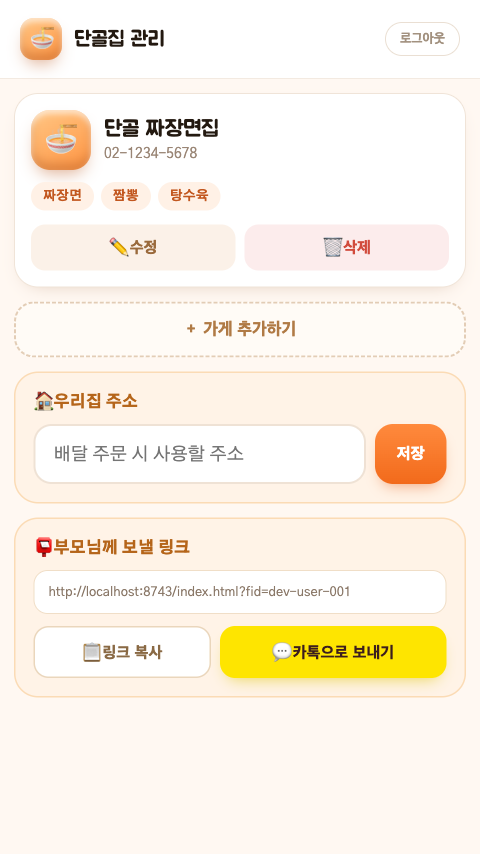

---

### Step 2. 가게 추가하기

로그인하면 **단골집 관리** 화면이 열립니다. **"＋ 가게 추가하기"** 버튼을 누르세요.

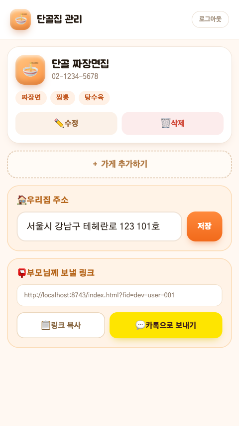

---

### Step 3. 가게 정보 입력

🏠 가게 이름, 📞 전화번호, 🍽 메뉴를 입력합니다.  
메뉴는 하나씩 입력 후 **＋** 버튼을 눌러 추가하고, 다 입력했으면 **저장하기**를 누르세요.

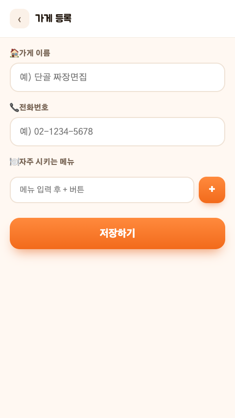

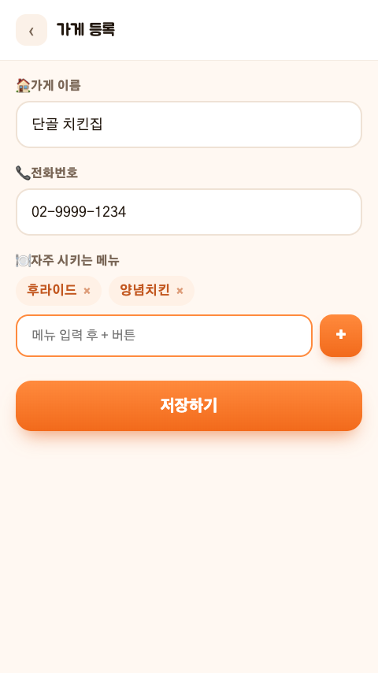

> 💡 가게/메뉴 이름에 "치킨", "피자", "죽" 같은 단어가 들어가면 아이콘이 자동으로 바뀌어요.

---

### Step 4. 우리집 주소 등록 & 링크 공유

가게를 다 등록했으면:

1. **"🏠 우리집 주소"** 칸에 배달 받을 주소를 입력하고 **저장**을 누르세요  
   (배달 주문 시 전화 멘트에 주소가 자동으로 들어갑니다)
2. **"📋 링크 복사"** 또는 **"💬 카톡으로 보내기"**로 부모님께 주문 링크를 전달하세요

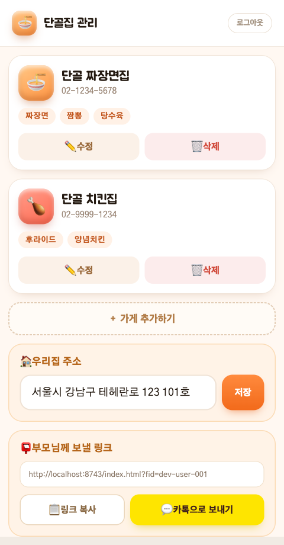

> 🔒 링크를 받은 분은 주문 화면만 볼 수 있고, 가게/메뉴 수정은 불가능합니다.  
> 나중에 가게나 주소를 바꾸고 싶을 때는 언제든 다시 로그인해서 수정하면 돼요.

---

## 부모님 사용 방법 (링크로 처음 접속)

자녀에게 받은 링크를 누르면 바로 시작! 회원가입·로그인 필요 없어요.

---

### Step 1. 가게 고르기

**"어디서 시킬까요?"** 화면에 등록된 단골 가게들이 보입니다.  
원하는 가게를 손가락으로 **한 번 톡** 누르세요.

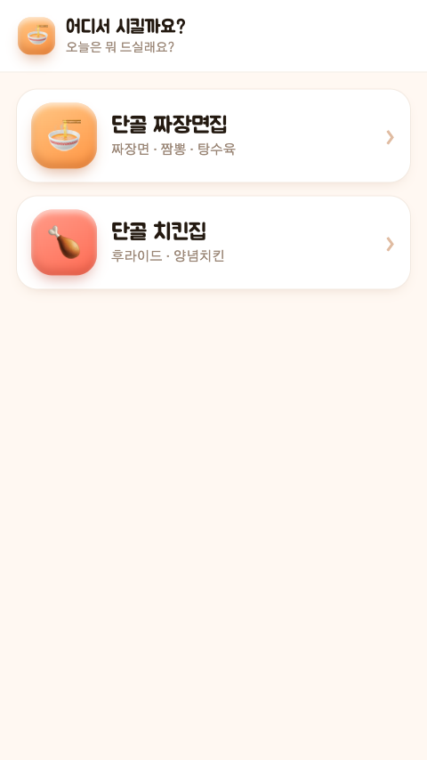

---

### Step 2. 메뉴 고르기

**"무엇을 드실까요?"** 화면에서 오늘 드시고 싶은 메뉴를 누르세요.  
여러 개 선택해도 되고, 다시 누르면 선택이 취소됩니다.

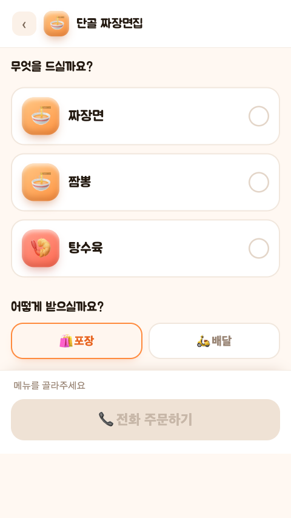

---

### Step 3. 포장 / 배달 고르기

메뉴 아래에서 **받는 방법**을 선택하세요.

| 버튼 | 의미 |
|------|------|
| 🛍️ 포장 | 직접 가게에 가서 찾아올 때 |
| 🛵 배달 | 집까지 배달받을 때 |

기본값은 **포장**이에요. 배달을 원하시면 **🛵 배달**을 눌러 주황색이 되는지 확인하세요.

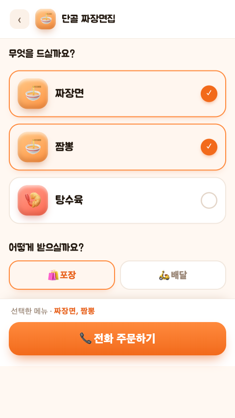

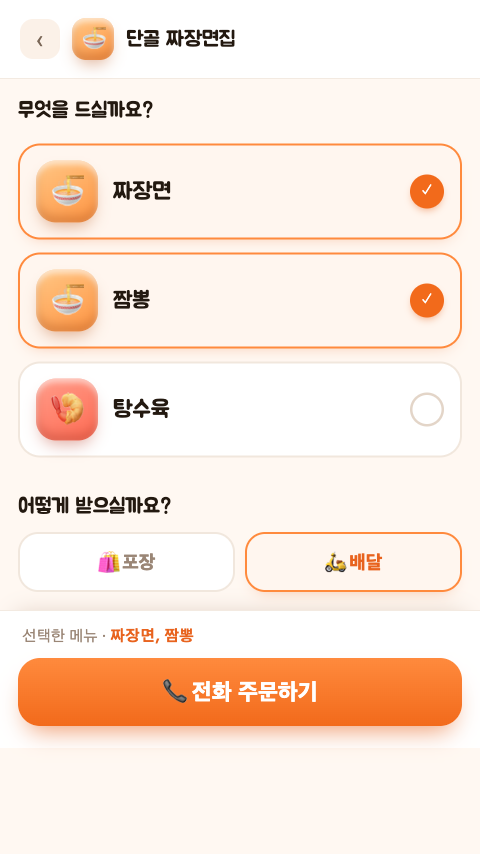

---

### Step 4. 전화 주문하기

메뉴와 방법을 고르면 주황색 **"📞 전화 주문하기"** 버튼이 활성화됩니다.  
버튼을 누르면 **주문 메모** 화면이 나와요.

화면에 적힌 문장을 그대로 읽으면 되고, **"📞 전화 걸기"**를 누르면 바로 연결돼요!

**포장** 주문 멘트:

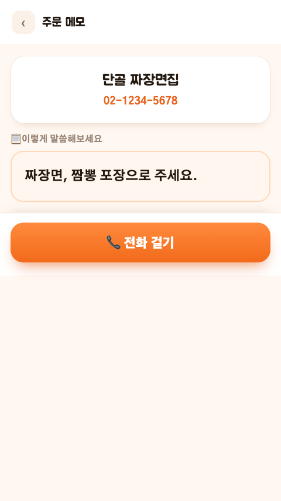

**배달** 주문 멘트 (주소 자동 포함):

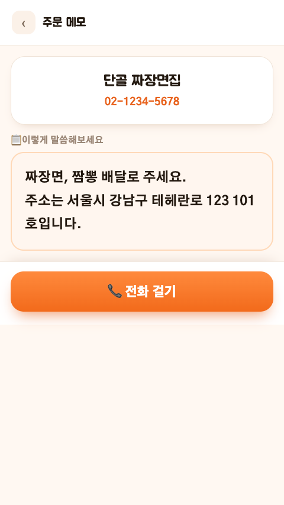

---

## 자주 묻는 질문

**Q. 카카오톡에서 부모님 링크를 눌렀는데 화면이 이상해요.**  
A. 부모님 전용 링크(`?fid=...`)는 카카오톡 안에서도 정상 동작해요. 만약 로그인 화면이 보인다면 잘못된 링크이므로 자녀에게 다시 받아주세요.

**Q. 배달 멘트에 주소가 안 보여요.**  
A. 자녀가 Step 4에서 주소를 입력 후 **저장 버튼까지** 눌렀는지 확인하고, 부모님 화면을 새로고침하면 반영돼요.

**Q. 가게를 수정하거나 삭제하고 싶어요.**  
A. 자녀가 관리자 화면(로그인 필요)에서 가게 카드의 **✏️ 수정** / **🗑 삭제** 버튼을 누르면 됩니다.

**Q. 부모님 링크를 카카오톡 채팅방에 고정(북마크)해두면 매번 찾기 편해요.**  
A. 링크를 카카오톡 채팅에 보낸 뒤, 메시지 길게 누르기 → **"채팅방 고정"** 또는 즐겨찾기에 등록해두면 바로 접근할 수 있어요.

---

자세한 배포/개발 설정은 [`README.md`](README.md), Firebase 셋업 절차는 [`plan.md`](plan.md)를 참고하세요.
